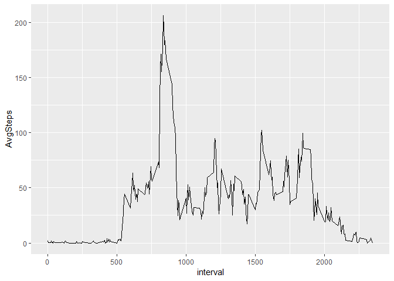
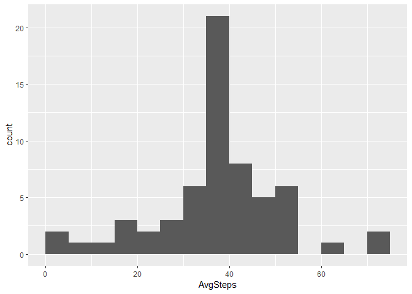
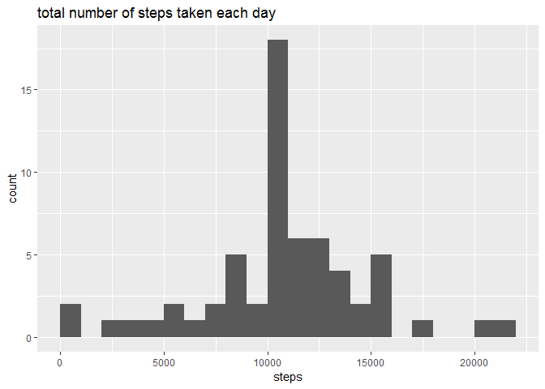
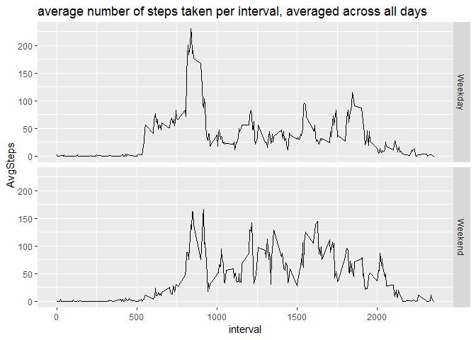

## Loading and preprocessing the data

```r
raw_data <- read.csv(unz("activity.zip","activity.csv"), header=TRUE, sep=",")
raw_data$date<-as.Date(raw_data$date)
raw_data$weekday <-weekdays(raw_data$date, abbreviate = FALSE)
working_data<- raw_data %>% filter(!is.na(steps))
```


## What is mean total number of steps taken per day?

```r
steps_by_day <- working_data %>% group_by(date) %>% summarize(steps = sum(steps))
ggplot(steps_by_day, aes(x = steps)) + geom_histogram(binwidth = 1000, center=500) + ggtitle("total number of steps taken each day")
```

<!-- -->

```r
print (paste("the mean of the total number of steps taken per day is ", mean(steps_by_day$steps)))
```

```
## [1] "the mean of the total number of steps taken per day is  10766.1886792453"
```

```r
print (paste("the median of the total number of steps taken per day is ",median(steps_by_day$steps)))
```

```
## [1] "the median of the total number of steps taken per day is  10765"
```

## What is the average daily activity pattern?


```r
steps_by_interval <- working_data %>% group_by(interval) %>%
summarize(AvgSteps = mean(steps))
ggplot(steps_by_interval, aes(x = interval, y = AvgSteps)) +
geom_line() + ggtitle("average number of steps taken per interval, averaged across all days")
```

<!-- -->

```r
print(paste("The 5-minute interval containing the maximum number of steps is the interval",(steps_by_interval %>% arrange(desc(AvgSteps)))[1,1]))
```

```
## [1] "The 5-minute interval containing the maximum number of steps is the interval 835"
```

## Imputing missing values
There are 8 entire days with missing values. Each day has 288 5-minute intervals. Then, 8*288 = 2304 rows with NAs.


```r
paste ("There are", (raw_data %>% summarize(NAcount = sum(is.na(steps))))[1,1], "rows with NAs")
```

```
## [1] "There are 2304 rows with NAs"
```

```r
impute.mean <- function(x) replace(x, is.na(x), mean(x, na.rm = TRUE))
filled_working_data<-raw_data %>% group_by(interval) %>% mutate(steps = impute.mean(steps))

Complete_steps_by_day <- filled_working_data %>% group_by(date) %>%
summarize(steps = sum(steps))
ggplot(Complete_steps_by_day, aes(x = steps)) + geom_histogram(binwidth=1000, center=500) + ggtitle("total number of steps taken each day")
```

<!-- -->

```r
paste("the mean of the total number of steps taken per day is ", mean(Complete_steps_by_day$steps))
```

```
## [1] "the mean of the total number of steps taken per day is  10766.1886792453"
```

```r
paste("the median of the total number of steps taken per day is ", median(Complete_steps_by_day$steps))
```

```
## [1] "the median of the total number of steps taken per day is  10766.1886792453"
```


## Are there differences in activity patterns between weekdays and weekends?
We can observe some differences in activity patterns. 

```r
filled_working_data <- filled_working_data %>% mutate(Week = factor(1 * (weekday %in% (c("Saturday", "Sunday"))), labels = c("Weekday", "Weekend")))

steps_by_weekAndinterval <- filled_working_data %>% group_by(Week, interval) %>%
summarize(AvgSteps = mean(steps))
ggplot(steps_by_weekAndinterval, aes(x=interval, y=AvgSteps, group=Week)) + geom_line() + facet_grid(Week~.) + ggtitle("average number of steps taken per interval, averaged across all days")
```

<!-- -->


