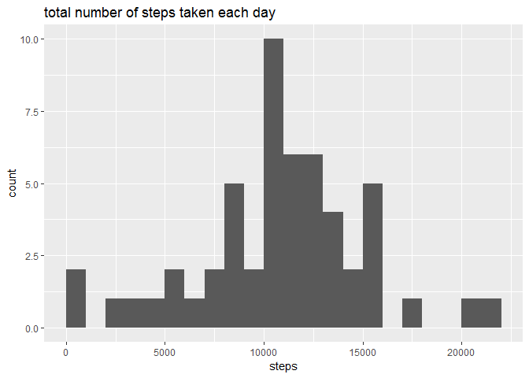
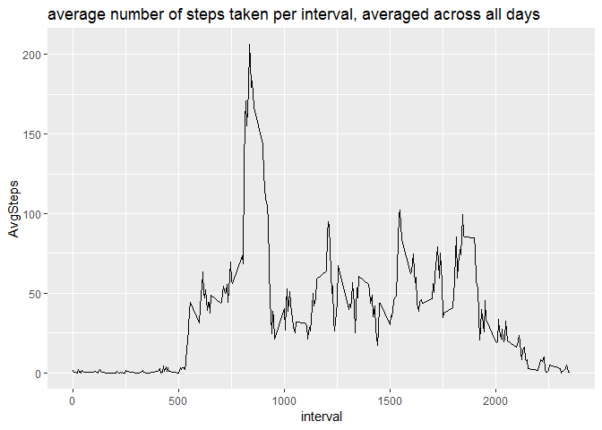

## Loading and preprocessing the data

```r
library(dplyr)
raw_data <- read.table(unz("activity.zip","activity.csv"), header=TRUE, sep=",")
working_data<- raw_data %>% filter(!is.na(steps))
```


## What is mean total number of steps taken per day?

```r
library(ggplot2)
steps_per_day <- working_data %>% group_by(date) %>%
summarize(AvgSteps = mean(steps), nbNA=sum(is.na(steps)))
ggplot(steps_per_day, aes(x = AvgSteps)) + geom_histogram(binwidth=5, center=2.5)
```

<!-- -->

```r
paste("the mean of the total number of steps taken per day is ", mean(steps_per_day$AvgSteps))
```

```
## [1] "the mean of the total number of steps taken per day is  37.3825995807128"
```

```r
paste("the median of the total number of steps taken per day is ", median(steps_per_day$AvgSteps))
```

```
## [1] "the median of the total number of steps taken per day is  37.3784722222222"
```

## What is the average daily activity pattern?


```r
steps_per_interval <- working_data %>% group_by(interval) %>%
summarize(AvgSteps = mean(steps))
ggplot(steps_per_interval, aes(x = interval, y = AvgSteps)) +
geom_line() 
```

<!-- -->

```r
paste("The 5-minute interval containing the maximum number of steps is the interval",
(steps_per_interval %>% arrange(desc(AvgSteps)))[1,1])
```

```
## [1] "The 5-minute interval containing the maximum number of steps is the interval 835"
```

## Imputing missing values

```r
paste ("There are", (raw_data %>% summarize(NAcount = sum(is.na(steps))))[1,1], "rows with NAs")
```

```
## [1] "There are 2304 rows with NAs"
```

```r
impute.mean <- function(x) replace(x, is.na(x), mean(x, na.rm = TRUE))
imputed_working_data<-raw_data %>% group_by(interval) %>% mutate(steps = impute.mean(steps))
steps_per_day <- imputed_working_data %>% group_by(date) %>%
summarize(AvgSteps = mean(steps))
ggplot(steps_per_day, aes(x = AvgSteps)) + geom_histogram(binwidth=5, center=2.5)
```

<!-- -->

```r
paste("the mean of the total number of steps taken per day is ", mean(steps_per_day$AvgSteps))
```

```
## [1] "the mean of the total number of steps taken per day is  37.3825995807128"
```

```r
paste("the median of the total number of steps taken per day is ", median(steps_per_day$AvgSteps))
```

```
## [1] "the median of the total number of steps taken per day is  37.3825995807128"
```


## Are there differences in activity patterns between weekdays and weekends?
